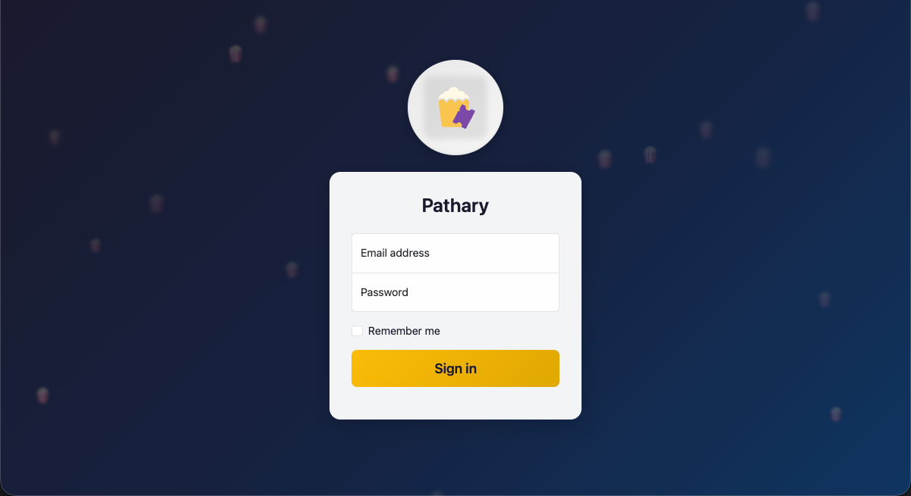

<p align="center">
  
</p>

<h1 align="center">Pathary</h1>

<p align="center">
  Self-hosted group movie tracking with popcorn ratings 🍿
</p>

---

> [!IMPORTANT]
> This repository is in **heavy development** and will be updated frequently. Expect breaking changes, new features, and ongoing improvements. Always back up your data before updating.

> [!NOTE]
> This project was built with the assistance of **Claude Code**, **OpenAI functionality**, manual research, and community contributions from the original Repository (movary). I leverage AI tools to accelerate development while maintaining code quality and security standards.

## What is Pathary?

Pathary is a **self-hosted movie tracking application** designed for friend groups. Rate movies on a **1-7 popcorn scale**, see what others in your group thought, and discover new films through TMDB integration. Share your movie experiences with public home and movie pages that anyone can view.

Built for privacy and control, Pathary runs entirely on your own infrastructure with no third-party tracking.

## What Makes Pathary Stand Out

- **🍿 Popcorn Rating System** — Unique 1-7 popcorn scale instead of traditional star ratings
- **👥 Group-First Design** — Built for friend groups to share movie opinions collectively
- **🌐 Public Pages** — Share movie ratings with anyone via public home and movie detail pages
- **🔐 Enterprise-Grade Security** — Full 2FA with TOTP, recovery codes, and trusted device management
- **📧 Modern Email Auth** — OAuth 2.0 support for Gmail and Microsoft 365 (no SMTP passwords needed)
- **🎨 Dark Mode First** — Beautiful Bootstrap 5 interface with native dark mode
- **🔒 Privacy Focused** — Self-hosted with no telemetry, tracking, or external dependencies
- **🚀 Easy Setup** — Docker-based deployment with SQLite (zero external database required)

## Key Features

### For Users

- **Popcorn Ratings** — Rate movies from 1-7 popcorns with optional comments
- **Public Profiles** — Share your movie taste with public home pages
- **Movie Discovery** — Browse and search movies via TMDB integration
- **Watch History** — Track when you watched each movie
- **Group Ratings** — See average ratings from your friend group
- **Responsive Design** — Works beautifully on mobile, tablet, and desktop

### Security & Authentication

- **Two-Factor Authentication (2FA)**
  - TOTP support (Google Authenticator, Authy, 1Password, etc.)
  - 10 single-use recovery codes (bcrypt-hashed)
  - Trusted device management (30-day trust)
  - Security audit logging for all events

- **Password Security**
  - Enforced password policy (10+ chars, mixed case, numbers, special characters)
  - Bcrypt hashing with automatic salt generation
  - Rate limiting on failed login attempts (5 attempts = 15 min lockout)
  - Session regeneration to prevent session fixation

- **OAuth Email Authentication**
  - Gmail OAuth 2.0 integration
  - Microsoft 365 OAuth 2.0 integration
  - AES-256-CBC encryption for client secrets and refresh tokens
  - Automatic token refresh
  - No SMTP passwords required

- **Session Management**
  - "Remember Me" functionality (10-year token expiry)
  - Cookie security (httponly, secure, SameSite=Lax)
  - HTTPS detection for reverse proxy setups
  - API token authentication for external clients

## Admin Features

Access the admin panel at `/admin` with admin privileges:

### Server Management

- **System Health Dashboard** — Real-time status of services, disk space, and database
- **User Management** — Create, edit, and manage user accounts
- **Email Configuration** — SMTP settings or OAuth 2.0 setup (Gmail/Microsoft 365)
- **TMDB Integration** — Configure API access for movie data
- **Server Settings** — Application URL, database mode, feature toggles

### Monitoring & Logs

- **Security Audit Log** — Track all security events (2FA, password changes, login attempts)
- **Application Logs** — Debug issues with detailed error logging
- **Health Checks** — Monitor database connectivity, disk space, and service status

## Differences vs Movary

Pathary is a **fork of Movary** with significant enhancements and new features:

| Feature | Movary | Pathary |
|---------|--------|---------|
| **OAuth Email Auth** | ❌ SMTP passwords only | ✅ Gmail + Microsoft 365 OAuth 2.0 |
| **2FA System** | ❌ No 2FA | ✅ TOTP + recovery codes + trusted devices |
| **Password Policy** | ❌ No enforcement | ✅ Strict policy with real-time validation |
| **Security Audit Log** | ❌ No logging | ✅ Comprehensive event logging |
| **Public Pages** | Limited | ✅ Full public home and movie pages |
| **Dark Mode** | Basic | ✅ Bootstrap 5 native dark mode |
| **UI/UX** | Standard | ✅ Modern, responsive design with Bootstrap Icons |

**Respectful Attribution:** Pathary builds on the excellent foundation created by [Movary](https://github.com/leepeuker/movary). We're grateful to Lee Peuker and the Movary community for their work.

## Screenshots

### Login Page

*Animated popcorn background with clean, modern login interface*

### Dashboard & Movie Ratings

*Browse movies, see group ratings, and discover new films*

### Two-Factor Authentication

*Secure your account with TOTP authentication*

### Security Settings

*Comprehensive security management: 2FA, recovery codes, trusted devices, password changes*

## Getting Started

### Prerequisites

- Docker and Docker Compose
- TMDB API key (free at [themoviedb.org/settings/api](https://www.themoviedb.org/settings/api))

### Quick Start

1. **Clone the repository**
   ```bash
   git clone https://github.com/benjaminmue/pathary.git
   cd pathary
   ```

2. **Create local environment file**
   ```bash
   cat > .env.local << 'EOF'
   TMDB_API_KEY=your_actual_api_key_here
   HTTP_PORT=80
   APPLICATION_URL=http://localhost
   EOF
   ```

3. **Start the application**
   ```bash
   # With SQLite (recommended for getting started)
   docker compose --env-file .env.local -f docker-compose.yml -f docker-compose.development.yml up -d

   # OR with MySQL
   docker compose --env-file .env.local -f docker-compose.yml -f docker-compose.development.yml -f docker-compose.mysql.yml up -d
   ```

4. **Run database migrations**
   ```bash
   sleep 5  # Wait for containers to start
   make app_database_migrate
   ```

5. **Open Pathary**

   Visit **http://localhost/** — first startup may take 30-60 seconds.

### Create First User

```bash
docker compose exec app php bin/console.php user:create \
  --email admin@example.com \
  --password "SecurePass123!" \
  --name "Admin"
```

## Configuration

### Required Environment Variables

| Variable | Description | Example |
|----------|-------------|---------|
| `TMDB_API_KEY` | The Movie Database API key (**required**) | `a1b2c3d4e5f6...` |
| `APPLICATION_URL` | Public URL of your Pathary instance | `http://localhost` or `https://pathary.example.com` |

### Optional Environment Variables

| Variable | Default | Description |
|----------|---------|-------------|
| `DATABASE_MODE` | `sqlite` | Database backend: `sqlite` or `mysql` |
| `HTTP_PORT` | `80` | Web server port (host machine) |
| `DATABASE_DISABLE_AUTO_MIGRATION` | `false` | Set to `true` to disable automatic migrations |
| `ENCRYPTION_KEY` | (auto-generated) | AES-256 key for OAuth secrets (32 bytes hex) |

### OAuth Email Configuration

To enable Gmail or Microsoft 365 authentication for outgoing emails:

1. Configure OAuth provider (Azure AD or Google Cloud Console)
2. Add redirect URI: `{APPLICATION_URL}/admin/server/email/oauth/callback`
3. Generate `ENCRYPTION_KEY`: `openssl rand -hex 32`
4. Configure in Admin panel → Server Management → Email Settings → OAuth tab

See [Wiki: OAuth Email Setup](https://docs.pathary.tv/oauth-email-setup/) for detailed instructions.

### Reverse Proxy Setup

When running behind Nginx, Traefik, or Caddy, ensure these headers are forwarded:

```nginx
proxy_set_header Host $host;
proxy_set_header X-Real-IP $remote_addr;
proxy_set_header X-Forwarded-For $proxy_add_x_forwarded_for;
proxy_set_header X-Forwarded-Proto $scheme;
```

The `X-Forwarded-Proto` header is critical for HTTPS detection and secure cookie handling.

See [.env.example](.env.example) for all available configuration options.

## Documentation

📖 **[Pathary Documentation](https://docs.pathary.tv)** — Comprehensive documentation

### Popular Pages

| Topic | Description |
|-------|-------------|
| [Getting Started](https://docs.pathary.tv/getting-started/) | Installation and first user setup |
| [Two-Factor Authentication](https://docs.pathary.tv/security/two-factor-authentication/) | TOTP, recovery codes, trusted devices |
| [OAuth Email Setup](https://docs.pathary.tv/oauth-email-setup/) | Gmail and Microsoft 365 configuration |
| [Password Policy and Security](https://docs.pathary.tv/security/password-policy-and-security/) | Password requirements and best practices |
| [Deployment](https://docs.pathary.tv/deployment/) | Production setup and reverse proxy configuration |
| [Database](https://docs.pathary.tv/architecture/database/) | Schema, migrations, and backup |
| [Troubleshooting](https://docs.pathary.tv/operations/logging-and-troubleshooting/) | Logs and common issues |

## Security Notes

### Secrets Management

**CRITICAL:** Never commit secrets to the repository.

- ✅ **DO:** Store secrets in `.env.local` (git-ignored)
- ❌ **DON'T:** Add `TMDB_API_KEY` to any tracked files
- ❌ **DON'T:** Commit OAuth client secrets, encryption keys, or SMTP passwords

### Security Best Practices

1. **Enable 2FA** for all accounts, especially admin accounts
2. **Use strong passwords** that meet the enforced policy (10+ chars, mixed case, numbers, special chars)
3. **Enable OAuth email auth** instead of SMTP passwords when possible
4. **Review security audit logs** periodically in Profile → Security → Security Activity
5. **Use HTTPS in production** with valid SSL certificates
6. **Keep Docker images updated** by rebuilding regularly
7. **Back up your database** before major upgrades

### Security Features

- Password hashing with bcrypt (cost factor 10)
- Session regeneration to prevent session fixation
- CSRF protection with SameSite cookies
- Security headers (CSP, X-Frame-Options, X-Content-Type-Options)
- Rate limiting on authentication endpoints
- HTTPS detection for reverse proxy setups
- AES-256-CBC encryption for OAuth secrets

## Development

### Local Setup

```bash
# Install dependencies
composer install

# Run all checks
composer test

# Individual checks
composer test-cs        # Code style
composer test-phpstan   # Static analysis (PHPStan)
composer test-psalm     # Static analysis (Psalm)
composer test-unit      # Unit tests
```

### Database Migrations

```bash
# Run migrations
make app_database_migrate

# Create new migration
php vendor/bin/phinx create MyMigration -c ./settings/phinx.php

# Rollback migration
make app_database_rollback
```

### Docker Commands

```bash
make build_development          # First time setup
make up_development             # Start (SQLite)
make up_development_mysql       # Start (MySQL)
make down                       # Stop all containers
make logs                       # View logs
make exec_app_bash              # Shell into container
```

## Contributing

Contributions are welcome! Please follow these guidelines:

### Issue Labels

When creating or triaging issues, use the [Issue Labels](https://docs.pathary.tv/issue-labels/) system:

**Every issue MUST have:**
- Exactly **one Type** label: `bug`, `enhancement`, `documentation`, `security`, `performance`, `refactor`, or `chore`
- Exactly **one Priority** label: `priority-p0` (critical), `priority-p1` (high), `priority-p2` (medium), or `priority-p3` (low)
- At least **one Area** label: `area-auth`, `area-2fa`, `area-email`, `area-admin`, `area-ui`, `area-movies`, `area-tmdb`, `area-database`, `area-docker`, or `area-api`

**Optional labels:**
- Status: `status-triage`, `status-ready`, `status-in-progress`, `status-blocked`, `status-needs-info`
- Community: `good first issue`, `help wanted`, `duplicate`, `invalid`, `question`, `wontfix`

See the full [Issue Labels Guide](https://github.com/benjaminmue/pathary/labels) with color-coded badges.

### Reporting Issues

📋 **[Issue Creation Guide](https://docs.pathary.tv/issue-labels/)** — Learn how to create well-labeled issues

- 🐛 **Bug Reports:** [Create an issue](https://github.com/benjaminmue/pathary/issues/new)
- 💡 **Feature Requests:** [Create an issue](https://github.com/benjaminmue/pathary/issues/new)
- 🔒 **Security Issues:** Email details privately instead of creating public issues

## Attribution

Pathary is a fork of [Movary](https://github.com/leepeuker/movary), created by Lee Peuker and contributors. We're grateful for their excellent work establishing the foundation of this project.

**Changes in Pathary:**
- Added OAuth 2.0 email authentication (Gmail, Microsoft 365)
- Implemented comprehensive 2FA system (TOTP, recovery codes, trusted devices)
- Added password policy enforcement with real-time validation
- Implemented security audit logging
- Enhanced public pages and UI/UX
- Updated to Bootstrap 5 with native dark mode
- Added admin system health dashboard

This fork maintains respect for the original project while extending functionality for enhanced security and user experience.

## License

MIT License — see [LICENSE](LICENSE).

**Original:** [Movary](https://github.com/leepeuker/movary) by Lee Peuker
**Fork:** Pathary by Benjamin Müller

---

<p align="center">
  Made with 🍿 by the Pathary community
</p>
