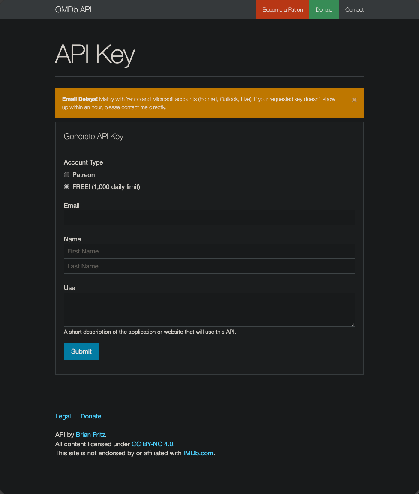

# OMDb Ratings

## Description

Pathary uses the [OMDb API](https://www.omdbapi.com/) to fetch both **IMDb** and **Rotten Tomatoes** ratings for your movies.

**What OMDb provides:**
- IMDb rating (0.0-10.0 scale)
- IMDb vote count
- Rotten Tomatoes Critics Score (0-100% scale)
- Fresh/Rotten tomato icon display

!!! Info

    OMDb API is free for up to 1,000 requests per day. For higher limits, consider a paid tier.
    Pathary automatically respects rate limits with a 250ms delay between requests.

## Getting an OMDb API Key

1. Visit [https://www.omdbapi.com/apikey.aspx](https://www.omdbapi.com/apikey.aspx)
2. Select **FREE! (1,000 daily limit)** for the free tier
3. Fill in your email, name, and usage description
4. Click **Submit** to request your API key
5. Check your email for the activation link
6. Activate your key via the email link



## Configuration

### Via Admin Panel

1. Navigate to **Admin** → **Server Management**
2. Click the **API Keys** tab
3. Scroll to **OMDb API Configuration**
4. Enter your API key
5. Click **Test Connection** to verify it works
6. Click **Save**

### Via Environment Variable

Add to your `.env` or `.env.local` file:

```bash
OMDB_API_KEY=your_api_key_here
```

!!! Warning

    Never commit API keys to version control. Always use `.env.local` for local development.

## Syncing Ratings

### Command

```bash
php bin/console.php omdb:sync
```

This command fetches **both** IMDb and Rotten Tomatoes ratings in a single operation.

### Flags

- `--help` - Detailed information about the command
- `--hours` - Number of hours required to have elapsed since last sync
- `--threshold` - Maximum number of movies to sync
- `--movieIds` - Comma separated string of movie IDs to force sync
- `--never-synced` - Only sync movies which were never synced before

### Examples

**Sync all movies:**
```bash
php bin/console.php omdb:sync
```

**Sync movies not updated in 24 hours (max 30):**
```bash
php bin/console.php omdb:sync --hours 24 --threshold 30
```

**Sync specific movies:**
```bash
php bin/console.php omdb:sync --movieIds 1,2,3
```

**Sync only never-synced movies:**
```bash
php bin/console.php omdb:sync --never-synced
```

## Scheduling Automatic Syncs

!!! Tip "Use Scheduled Sync"

    For automatic daily syncs of both TMDB and OMDb, use the [Scheduled Sync](scheduled-sync.md) feature.
    It automatically syncs movies 7+ days old (max 1000/day) for both TMDB metadata and OMDb ratings.

**Manual cron setup** (OMDb only):

```bash
# Sync ratings daily at 2 AM (max 30 movies per run)
0 2 * * * cd /path/to/pathary && docker compose exec -T app php bin/console.php omdb:sync --threshold 30
```

**Recommended frequency:** Weekly is usually sufficient for most libraries.

## Rating Display

### Movie Detail Page

Ratings appear in the **External Ratings** section:

- **TMDB** - Shows rating/10
- **IMDb** - Shows rating/10 (from OMDb)
- **Rotten Tomatoes** - Shows percentage with Fresh/Rotten icon

### Fresh vs Rotten Icons

- **Fresh (Green Tomato)** - 60% or higher
- **Rotten (Green Splat)** - Below 60%

### Hiding Ratings

Users can hide external ratings via their profile settings:
- Go to **Profile** → **Settings**
- Toggle **Hide TMDB and IMDb ratings** to hide all external ratings

## System Health Monitoring

Check the **System Health** page in the admin panel to monitor:

- ✅ OMDb API configuration status
- 📊 Daily request quota usage
- 🕐 Last successful sync timestamp
- ⚠️ Any API errors or rate limit issues

## Database Schema

### OMDb Rating Fields

**IMDb Ratings:**
- `imdb_rating_average` (DECIMAL) - IMDb rating (0.0-10.0)
- `imdb_vote_count` (INT) - Number of IMDb votes

**Rotten Tomatoes Ratings:**
- `rt_rating_average` (TINYINT) - RT Critics Score (0-100)
- `rt_rating_vote_count` (INT) - Review count (placeholder: 1 when rating exists)

**Metadata:**
- `updated_at_omdb` (DATETIME) - Last OMDb sync timestamp

## Rate Limits

### Free Tier
- **1,000 requests per day**
- Resets at midnight UTC
- Pathary uses 250ms delay between requests (~3,450 max/day)

### Paid Tiers
- **Patreon Supporter** - Higher daily limits
- See [OMDb pricing](https://www.omdbapi.com/) for details

### Handling Rate Limits

If you hit the daily limit:
1. Wait 24 hours for quota reset
2. Use `--threshold` flag to limit syncs per run
3. Schedule smaller, more frequent syncs
4. Consider upgrading to a paid tier

## Troubleshooting

### No Ratings After Sync

**Possible causes:**
1. Movie has no IMDb ID (OMDb requires IMDb ID)
2. Movie is too new/obscure (no ratings available)
3. API key is invalid or expired

**Solutions:**
- Check movie has `imdb_id` in database
- Verify API key works via "Test Connection" in admin panel
- Check System Health for quota/error status

### "OMDb API key not configured"

**Solution:** Configure your API key via admin panel or environment variable (see Configuration section above).

### Rate Limit Exceeded

**Error message:** `Request limit reached`

**Solution:**
- Wait 24 hours for quota reset
- Use `--threshold` to limit movies per sync
- Upgrade to paid OMDb tier

### Connection Errors

**Symptoms:** Sync fails with timeout or connection errors

**Solutions:**
1. Check internet connection
2. Verify OMDb API is online: https://www.omdbapi.com/
3. Check System Health page for error details
4. Retry sync - command automatically retries failed requests

## Migration from IMDb Scraper

!!! Info "Deprecated Feature"

    The old `imdb:sync` command (web scraping) has been removed in favor of OMDb API.
    OMDb provides more reliable access to IMDb ratings plus Rotten Tomatoes ratings.

### What Changed

| Feature | Old IMDb Scraper | New OMDb API |
|---------|-----------------|--------------|
| Command | `imdb:sync` ❌ | `omdb:sync` ✅ |
| IMDb Ratings | ✅ | ✅ |
| RT Ratings | ❌ | ✅ |
| Reliability | Low (breaks when HTML changes) | High (API-based) |
| Maintenance | Frequent fixes needed | Stable |

### Migration Steps

1. Obtain OMDb API key (see above)
2. Configure key in admin panel
3. Run initial sync: `php bin/console.php omdb:sync`
4. Existing IMDb ratings will be updated
5. New RT ratings will be added

Your existing rating data is preserved during migration.

## FAQ

**Q: Does OMDb cost money?**
A: The free tier provides 1,000 requests/day, sufficient for most personal libraries. Paid tiers available for larger libraries.

**Q: What if a movie has no ratings?**
A: "N/A" will be displayed. This is normal for very new or obscure movies.

**Q: How often should I sync?**
A: Weekly is usually sufficient. Use `--hours 168` to sync movies not updated in 7 days.

**Q: Can I still see TMDB ratings without OMDb?**
A: Yes, TMDB ratings are independent and don't require OMDb.

**Q: What happens if OMDb is down?**
A: The sync command will fail gracefully. Check System Health and retry later.

**Q: Does this replace TMDB ratings?**
A: No, TMDB ratings continue to work independently. OMDb only provides IMDb and RT ratings.

## See Also

- [OMDb API Documentation](https://www.omdbapi.com/)
- [System Health Monitoring](system-health.md)
- [Admin Panel Guide](admin-panel.md)
- [TMDB Movie Sync](tmdb-movie-sync.md)
