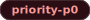
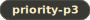

# Issue Labels

This page documents the GitHub Issue label taxonomy for Pathary.

> **📌 [View actual labels with colors →](https://github.com/benjaminmue/pathary/labels)**

## Label Requirements

**Every issue MUST have:**
- Exactly **one Type** label
- Exactly **one Priority** label
- At least **one Area** label

**Optional labels:**
- Status labels for workflow tracking

## Label Groups

### Type Labels

Choose exactly one:

| Label | Description |
|:---:|:---:|
|  | Something isn't working correctly |
|  | New feature or request |
|  | Improvements or additions to documentation |
|  | Security issues or implementations |
|  | Performance optimization issues |
|  | Code quality improvements without new features |
|  | Maintenance tasks (dependencies, tooling, CI) |

### Priority Labels

Choose exactly one:

| Label | Description |
|:---:|:---:|
|  | Critical/Blocker - Must be fixed immediately |
|  | High priority - Should be addressed soon |
|  | Medium priority - Normal timeline |
|  | Low priority - Nice to have |

### Area Labels

Choose one or more:

| Label | Description |
|:---:|:---:|
|  | Authentication & user management |
|  | Two-factor authentication |
|  | Email functionality (SMTP, OAuth, notifications) |
|  | Admin panel & server management |
|  | User interface & frontend |
|  | Movie tracking & ratings |
|  | TMDB API integration |
|  | Database schema & migrations |
|  | Docker & containerization |
|  | API endpoints & integrations |

### Status Labels (Optional)

| Label | Description |
|:---:|:---:|
|  | Needs initial review and categorization |
|  | Ready for development |
|  | Currently being worked on |
|  | Blocked by dependencies or external factors |
|  | Waiting for more information from reporter |

### Community & Generic Labels

| Label | Description |
|:---:|:---:|
|  | Good for newcomers |
|  | Extra attention is needed |
|  | This issue or pull request already exists |
|  | This doesn't seem right |
|  | Further information is requested |
|  | This will not be worked on |

## Triage Checklist

When creating or triaging an issue:

1. **Pick Type** - What kind of issue? (bug, enhancement, security, etc.)
2. **Pick Priority** - How urgent? (p0, p1, p2, p3)
3. **Pick Area(s)** - Which part of codebase? (auth, ui, database, etc.)
4. **Add Status** (optional) - Where in workflow? (triage, ready, in-progress, blocked)

## Examples

### Security Vulnerability

**Issue**: "XSS vulnerability in user profile form"

**Labels**:     

### Feature Request

**Issue**: "Add email notifications for new ratings"

**Labels**:     

### Performance Issue

**Issue**: "Movie list page loads slowly with 1000+ movies"

**Labels**:     

### Documentation Update

**Issue**: "Add OAuth setup instructions to wiki"

**Labels**:    

## Questions?

If unsure which labels to apply, add  and a maintainer will review during triage.
